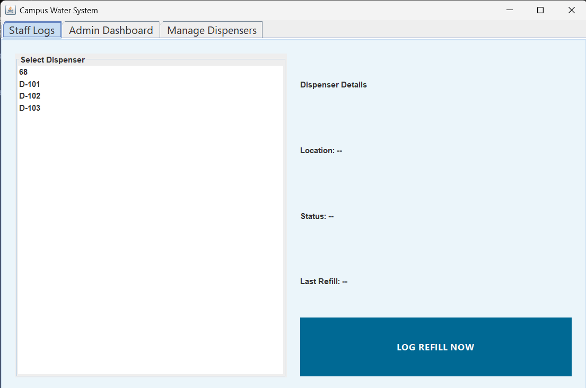
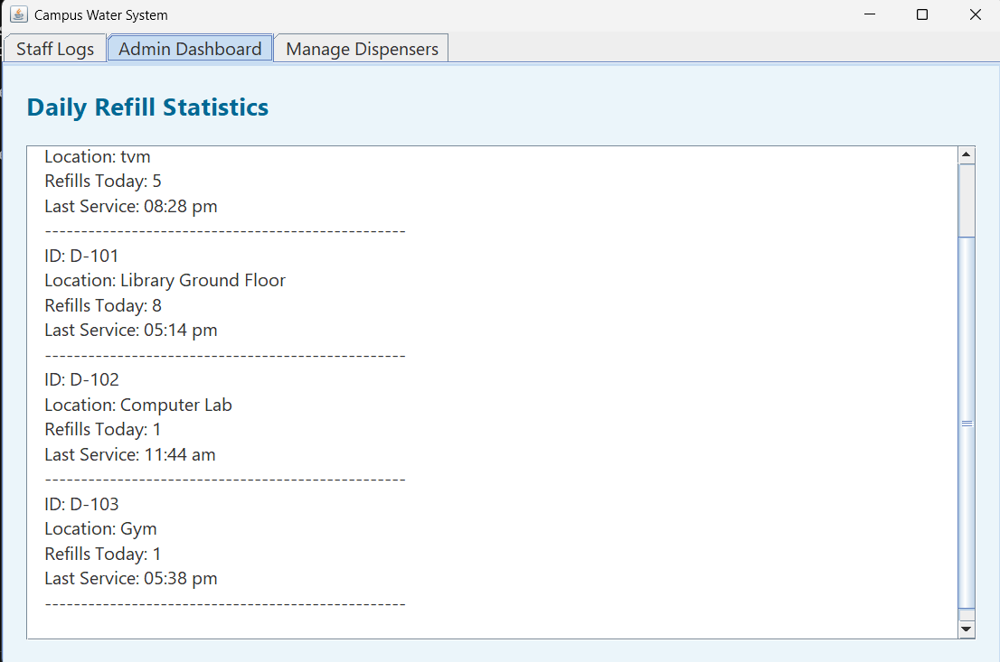

# Campus Drinking Water Refill Logger 💧

### 👨‍💻 Team Members
* **Member 1:** Jerin Mathew - 24UBC134
* **Member 2:** Giridhar Girish - 24UBC130

---

### 📌 Problem Statement & Objective
**Problem:** Managing water dispensers across a large campus is difficult. Manual logs are often lost, illegible, or inaccurate, leading to dispensers running empty or maintenance being missed.

**Objective:** To develop a Java-based GUI application that digitizes the refill logging process. This system allows staff to log refills instantly and provides administrators with a clean, easy-to-read dashboard to monitor water availability and refill frequency in real-time.

---

### 🚀 Features
* **Role-Based Access:** Separate tabs for Staff (Data Entry), Admins (Monitoring), and Management (Adding new dispensers).
* **Live Statistics Dashboard:** A clean, text-based Admin view that automatically refreshes to show the latest refill counts and service times for every campus dispenser.
* **Data Persistence:** Uses **MySQL Database** to store refill history permanently so no data is lost when the app closes.
* **Modern UI:** A custom "Ocean Blue" design theme using Java Swing with streamlined, user-friendly layouts.

### 🛠 Technologies Used
* **Language:** Java (JDK 17+)
* **GUI:** Java Swing
* **Database:** MySQL (via XAMPP)
* **Connectivity:** JDBC (MySQL Connector/J)

---

### ⚙️ Steps to Run the Program

1.  **Setup Database:**
    * Open XAMPP and start **MySQL**.
    * Create a database named `campus_water_db`.
    * Run the following SQL script to create the table:
        ```sql
        CREATE TABLE dispensers (
            id VARCHAR(10) PRIMARY KEY,
            location VARCHAR(100),
            refills_today INT,
            last_refill_time VARCHAR(20)
        );
        ```

2.  **Configure Project:**
    * Ensure the MySQL Connector (`mysql-connector-j-8.x.x.jar`) is placed inside a `lib` folder in your project directory.

3.  **Compile and Run via Command Line (Windows):**
    ```bash
        javac -cp ".;lib/mysql-connector-j-9.6.0.jar" -d bin src/*.java
        java -cp "bin;lib/mysql-connector-j-9.6.0.jar" WaterLoggerApp
    ```
    *(Note: If evaluating on Mac/Linux, replace the semicolons `;` with colons `:` in the commands above).*

---

### 📸 Screenshots

#### 1. Staff Interface (Log Entry)


#### 2. Admin Dashboard (Live Statistics)


---

### 🧪 Sample Input & Output

**Scenario:** A staff member logs a refill for the Library dispenser.

* **Input (Staff Panel):**
    * Select ID: `D-101`
    * Action: Click "LOG REFILL NOW"
* **Output (System):**
    * UI Popup: "Refill Logged!"
    * Database Update: `refills_today` value increases by 1 in the MySQL table.
    * Admin Dashboard: The live text view updates instantly to show the new refill count and the exact time it was serviced for `D-101`.

---

### 🎥 Video Demo
[Click here to watch the project demo](LINK_TO_YOUR_YOUTUBE_VIDEO)