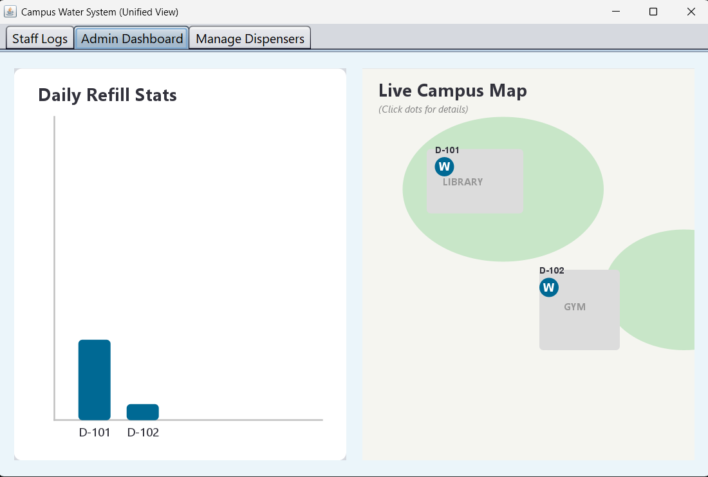
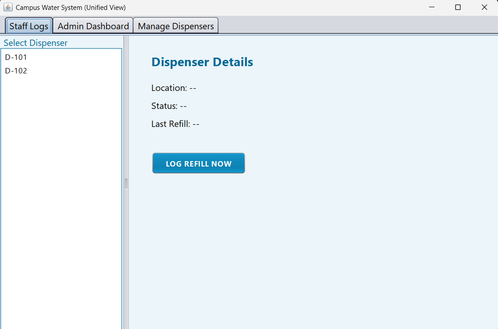

# Campus Drinking Water Refill Logger 💧

### 👨‍💻 Team Members
* **Member 1:** Giridhar Girish - 24ubc130
* **Member 2:** Jerin Mathew - 24ubc134

---

### 📌 Problem Statement & Objective
**Problem:** Managing water dispensers across a large campus is difficult. Manual logs are often lost, illegible, or inaccurate, leading to dispensers running empty or maintenance being missed.

**Objective:** To develop a Java-based GUI application that digitizes the refill logging process. This system allows staff to log refills instantly and provides administrators with a visual dashboard to monitor water availability and refill frequency in real-time.

---

### 🚀 Features
* **Role-Based Access:** Separate views for Staff (Data Entry) and Admins (Monitoring).
* **Interactive Map:** A visual "Live Campus Map" where admins can click dots to see dispenser status.
* **Data Persistence:** Uses **MySQL Database** to store refill history permanently.
* **Analytics:** A dynamic bar chart showing daily refill statistics.
* **Modern UI:** A custom "Ocean Blue" design theme using Java Swing.

### 🛠 Technologies Used
* **Language:** Java (JDK 17+)
* **GUI:** Java Swing (AWT)
* **Database:** MySQL (via WorkBench)
* **Connectivity:** JDBC (MySQL Connector/J)

---

### ⚙️ Steps to Run the Program

1.  **Setup Database:**
    * Open Workbench and start **MySQL**.
    * Create a database named `campus_water_db`.
    * Run the SQL script:
        ```sql
        CREATE TABLE dispensers (
            id VARCHAR(10) PRIMARY KEY,
            location VARCHAR(100),
            refills_today INT,
            last_refill_time VARCHAR(20)
        );
        ```

2.  **Configure Project:**
    * Ensure `mysql-connector-j-9.x.x.jar` is in the `lib` folder.

3.  **Run via Command Line:**
    ```bash
    java -cp "bin;lib/mysql-connector-j-8.0.33.jar" WaterLoggerApp
    ```

---

### 📸 Screenshots

#### 1. Admin Dashboard (Interactive Map)


#### 2. Staff Interface (Log Entry)


---

### 🧪 Sample Input & Output

**Scenario:** A staff member logs a refill for the Library dispenser.

* **Input (Staff Panel):**
    * Select ID: `D-101`
    * Action: Click "LOG REFILL NOW"
* **Output (System):**
    * Popup: "Refill Logged & Saved to DB!"
    * Database Update: `refills_today` increases by 1.
    * Admin Map: Dot for D-101 turns Blue (Active).

---
